# RTOS
## I. Reference
- document : 
- video    : [play list youtube](https://www.youtube.com/playlist?list=PL831drV1RoWvU3AIoOKzeoz9AD625a97V) 
- Software 
\- IDE      : [STM32CubeIDE]() | [Keilcv5]() & [STM32CubeMx]()
\- other    : [SEGGER SystemView]()
- RTOS     : [FreeRTOS]()
- Board    : STM32F407 Discovery | NUCLEO-F446RE

## II. Creating FreeRTOS base project for STM32 MCUs

- add FreeRTOS folder into project
\- in portable folder delete all folders exept GCC and MemMang
- add Config folder into project
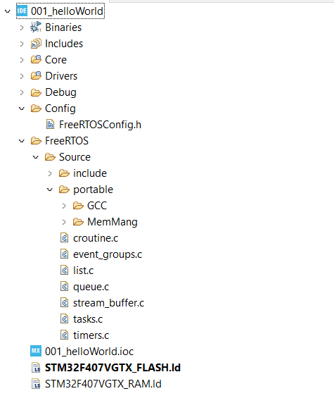
- add Include part 
\- open Properties(alt+enter) => C/C++ General => Paths and Symbols => add include parth
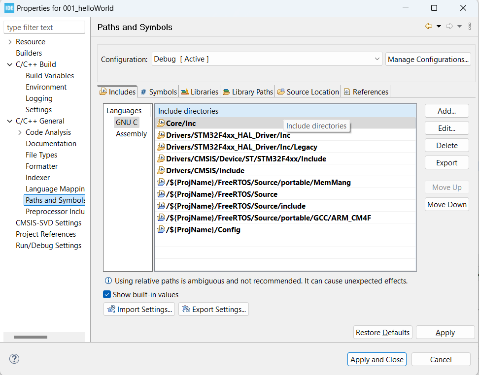
- wite "#define configSUPPORT_DYNAMIC_ALLOCATION 1" in main file
\
`` note fix error `` [video](https://www.youtube.com/watch?v=Ksjdh0KAEi0&list=PLxGj5QMILu9GIB2PIgY_8RoRpRPOLvQ3J&index=5)

## III. Introduction about RTOS 
### 1. Real Time Applications (RTAs)
- RTAs không phải là ứng dụng thực thi nhanh
- RTAs là một ứng dụng xác định thời gian. Có nghĩa là thời gian đáp ứng của các sự kiện là không đổi(độ lệch trong RTAs rát nhỏ tính bằng ms hoặc s trong Soft real time)
- đối với các ứng dụng Hard real time phải hoàn thành trong một khoảng thời gian giới hạn. nếu không thực hiện được sẽ dẫn đến lỗi hệ thống
### 2. Real Time OS
- Đây là một hệ điều hành được thiết kế đặc biệt để chạy các ứng dụng với thời gian rất chính xác và mức độ tin cậy cao.
- Để được coi là "thời gian thực", một hệ điều hành phải có thời gian tối đa đã biết cho mỗi hoạt động quan trọng mà nó thực hiện. Một số hoạt động này bao gồm
\- Xử lý các ngắt và ngoại lệ hệ thống nội bộ \
\- Xử lý các phần quan trọng \
\- Cơ chế lập lịch, v.v. 

### 3. RTOS vs GPOS 
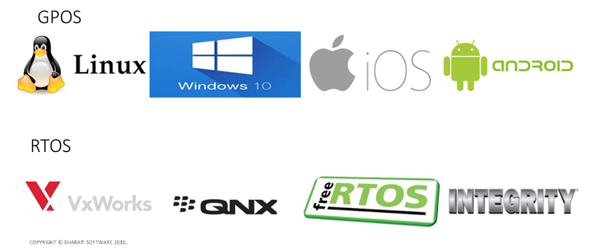 
#### Task Scheduling 
- GPOS
\- Việc lập lịch tác vụ không phải lúc nào cũng dựa trên "mức độ ưu tiên"
\- GPOS được lập trình để xử lý việc lập lịch theo cách mà nó có thể đạt được thông lượng(Throughput) cao. \
\- Trong GPOS, trình lập lịch thường sử dụng chính sách công bằng để phân phối luồng và quy trình vào CPU. \
\- Chính sách như vậy cho phép thông lượng tổng thể cao theo yêu cầu của các ứng dụng máy tính để bàn và máy chủ, nhưng không đảm bảo rằng các luồng hoặc quy trình có mức độ ưu tiên cao, quan trọng về thời gian sẽ thực thi thay vì các luồng có mức độ ưu tiên thấp hơn. 
- RTOS
\- Hầu hết sử dụng phương pháp lập lịch tác vụ ưu tiên dựa trên mức độ ưu tiên \
\- Mặt khác trong RTOS, các luồng thực thi theo thứ tự ưu tiên của chúng. Nếu một luồng có mức độ ưu tiên cao sẵn sàng chạy, nó sẽ tiếp quản CPU từ bất kỳ luồng có mức độ ưu tiên thấp nào có thể đang thực thi.  \
\- Tại đây, một luồng có mức độ ưu tiên cao sẽ được thực thi trên các luồng có mức độ ưu  lên thấp. Tất cả "thực thi luồng có mức độ ưu tiên thấp" sẽ bị tạm dừng. Thực thi luồng có mức độ ưu tiên cao sẽ
chỉ được ghi đè nếu một yêu cầu đến từ một luồng có mức độ ưu tiên cao hơn.
- ``note``
\- Thông lượng có nghĩa là  tổng số quy trình(Process) hoàn tất việc thực thi của chúng trên một đơn vị thời gian
- `` summary`` 
\- Đối với RTOS, việc đạt được khả năng dự đoán hoặc bản chất xác định thời gian quan trọng hơn so với thông lượng 
\- đối với GPOS, việc đạt được thông lượng cao hơn để thuận tiện cho người dùng quan trọng hơn 

#### Task Switching Latency
- Trong Máy tính, Độ trễ(Latency) có nghĩa là Thời gian trôi qua giữa một kích thích và phản ứng với nó.
- Độ trễ chuyển đổi tác vụ(Task Switching Latency) có nghĩa là khoảng thời gian giữa Sự kích hoạt của một sự kiện và thời điểm mà tác vụ xử lý sự kiện đó được phép chạy trên CPU
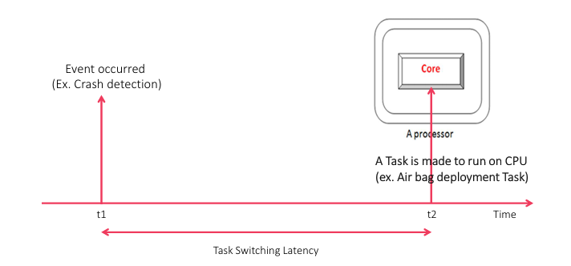 \
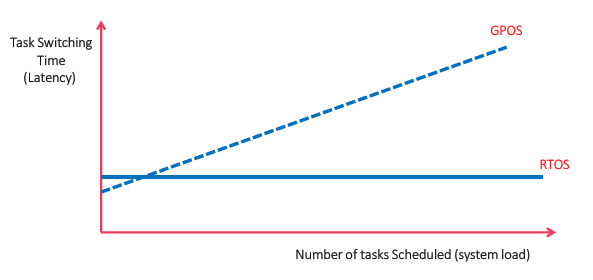

#### Priority Inversion
- Hiệu ứng đảo ngược ưu tiên (Priority Inversion) có nghĩa là khi một task vụ đang trong quá trình sử dụng tài nguyên thì một task khác có mức ưu tiên cao hơn truy nhập. Task có mức độ ưu tiên cao hơn không thể thay thế cho task trước đó  
\- đối với GPOS: Hiệu ứng đảo ngược ưu tiên(Priority Inversion) không đáng kể
\- đối với RTOS: Hiệu ứng đảo ngược ưu tiên(Priority Inversion) phải được giải quyết

#### Kernel Preemption
- Quyền ưu tiên(Preemption)
\- Trong tính toán, quyền ưu tiên là hành động tạm thời xóa tác vụ khỏi trạng thái đang chạy mà không cần sự hợp tác của tác vụ đó
- Trong RTOS 
\- các luồng thực thi theo thứ tự ưu tiên của chúng. Nếu một luồng có mức độ ưu tiên cao sẵn sàng để chạy, trong một khoảng thời gian nhỏ và giới hạn, nó sẽ tiếp quản CPU từ bất kỳ luồng có mức độ ưu tiên thấp hơn nào có thể đang thực thi mà chúng ta gọi là quyền ưu tiên.
\- Tác vụ có mức độ ưu tiên thấp hơn sẽ được thực hiện để rời khỏi CPU, nếu tác vụ có mức độ ưu tiên cao hơn muốn thực thi
\- Các hoạt động của hạt nhân(Kernel) RTOS có thể được chiếm đoạt trước
- Đối với GPOS
\- hạt nhân GPOS không thể được chiếm đoạt trước 
### 4. Multi-tasking
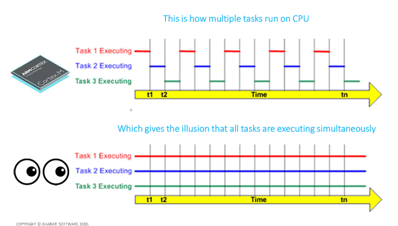

## IV. FreeRTOS API Task Creation and Task Implement Function
### 1. API Task Creation
``` C
BaseType_t xTaskCreate( TaskFunction_t pxTaskCode,
                        const char * const pcName,
                        const short uxStackDepth,
                        void * const pvParameters,
                        UBaseType_t uxPriority,
                        TaskHandle_t * const pxCreatedTask );
/*
    @param[pxTaskCode]    : hàm xử lý của task 
    @param[pcName]        : tên của task
    @param[uxStackDepth]  : độ dài của stack cho task
    @param[pvParameters]  : tham số truyền vào cho hàm pxTaskCode
    @param[uxPriority]    : mức ưu tiên của task 
    @param[pxCreatedTask] : Task handle chúa thông tin của task được tạo

    @retval : trả về
    note : có thẻ sử dụng hàm để kiểm tra API có thành công hay không
*/
```
### 2. Task Implementation Function
``` C
void vATaskFuntion(void *arg)
{
    // code
    while(1)
    {
        // code
    }
    // Khi thoát khỏi vòng lạp phải cần xóa trước khi thoát hàm
    vTaskDelete(NULL);    
}
```

### 3. Quá trình sau khi gọi API xTaskCreate
- các thông tin của Task mới sẽ được lưu trong Heap trên RAM
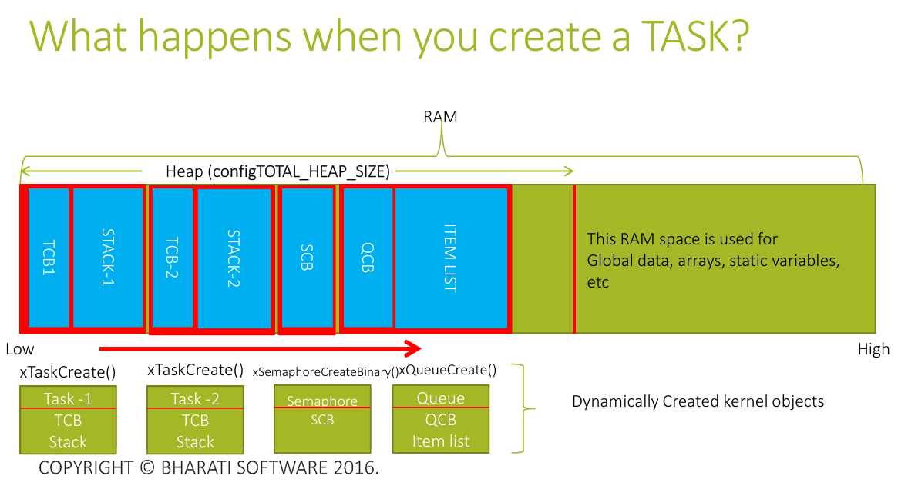


## V. Idle Task 
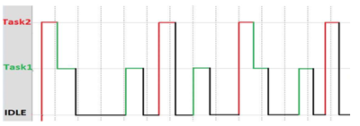
- Idle Task được tự động tạo ra khi trình lập lịch RTOS được khởi động để đảm bảo luôn có ít nhất một nhiệm vụ có thể chạy.
- Task này được tạo ở mức ưu tiên thấp nhất có thể để đảm bảo không sử dụng bất kỳ thời gian CPU nào nếu có các nhiệm vụ ứng dụng có mức ưu tiên cao hơn ở trạng thái sẵn sàng.
- Idle Task có trách nhiệm giải phóng bộ nhớ được RTOS phân bổ cho các nhiệm vụ đã bị xóa
- Có thể cung cấp một hàm Hook ứng dụng trong tác vụ nhàn rỗi để gửi CPU đến chế độ năng lượng thấp khi không có tác vụ hữu ích nào đang thực thi.

## VI. FreeRTOS Timer Services Task (Timer_svc)
- Điều này cũng được gọi là tác vụ daemon hẹn giờ
- Tác vụ daemon hẹn giờ xử lý "Bộ hẹn giờ phần mềm"
- Tác vụ này được tạo tự động khi trình lập lịch được khởi động và nếu configUSE_TIMERS = 1 trong FreeRTOSConfig.h
- RTOS sử dụng daemon này để quản lý bộ hẹn giờ phần mềm FreeRTOS và không có thứ gì khác.
- Nếu bạn không sử dụng bộ hẹn giờ phần mềm trong ứng dụng FreeRTOS của mình thì bạn cần sử dụng tác vụ daemon hẹn giờ này. Đối với điều đó, chỉ cần đặt configUSE_TIMERS = 0 trong FreeRTOSConfig.h
- Tất cả các hàm gọi lại bộ hẹn giờ phần mềm thực thi trong ngữ cảnh của tác vụ daemon hẹn giờ

## VI. Task Scheduling and API xTaskStartScheduler()
### 1. Trình lập lịch (Scheduler)
- nó chỉ là một đoạn mã thực hiện việc chuyển đổi tác vụ vào và chuyển đổi tác vụ ra theo chính sách lập lịch đã chọn.
- Trình lập lịch là lý do tại sao nhiều tác vụ chạy trên hệ thống của bạn một cách hiệu quả
- Công việc cơ bản của trình lập lịch là xác định tác vụ tiềm năng tiếp theo sẽ chạy trên CPU
- Trình lập lịch có khả năng chiếm quyền trước một tác vụ đang chạy nếu bạn định cấu hình như vậy

### 2. Chính sách/kiểu lập lịch (Scheduling Policies)
- Lập lịch ưu tiên đơn giản (Round robin)
- Lập lịch ưu tiên dựa trên mức độ ưu tiên
- Lập lịch hợp tác
- ``note``
\- Chính sách lập lịch là thuật toán được trình lập lịch sử dụng để quyết định tác vụ nào sẽ thực hiện tại bất kỳ thời điểm nào.
\- FreeRTOS hoặc hầu hết các hệ điều hành thời gian thực có khả năng sẽ sử dụng Lập lịch ưu tiên dựa trên mức độ ưu tiên theo mặc định

### 3. FreeRTOS Scheduling 
- Scheduler là một phần của mã hạt nhân(Kernel) chịu trách nhiệm quyết định tác vụ nào sẽ được thực thi tại bất kỳ thời điểm cụ thể nào trên CPU.
- Chính sách lên lịch là thuật toán được trình lên lịch sử dụng để quyết định tác vụ nào sẽ thực thi tại bất kỳ thời điểm nào.
- configUSE_PREEMPTION của mục có thể cấu hình freeRTOSConfig.h quyết định chính sách lên lịch trong freeRTOS. \
\- Nếu configUSE_PREEMPTION = 1, thì chính sách lên lịch sẽ là lập lịch ưu tiên dựa trên mức độ ưu tiên. \
\- Nếu configUSE_PREEMPTION = 0, thì chính sách lên lịch sẽ là lập lịch hợp tác

### 4. FreeRTOS Scheduler Implementation
- Trong FreeRTOS, mã trình lập lịch thực sự là sự kết hợp của Mã chung FreeRTOS + Mã cụ thể của Kiến trúc \
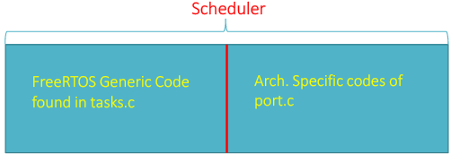 
- Mã cụ thể về kiến ​​trúc chịu trách nhiệm đạt được lập lịch tác vụ.
- Tất cả các mã và cấu hình cụ thể về kiến ​​trúc đều được triển khai trong port.c và portmacro.h
Nếu bạn đang sử dụng bộ xử lý ARM Cortex Mx thì bạn sẽ có thể định vị các trình xử lý ngắt bên dưới trong port.c, đây là một phần của triển khai trình lập lịch của freeRTOS \

- vPortSVCHandler()     : Được sử dụng để khởi chạy tác vụ đầu tiên. Được kích hoạt bởi lệnh SVC
- vPortSVCHandler()     : Được sử dụng để đạt được ngữ cảnh chuyển đổi giữa các tác vụ Được kích hoạt bằng cách chờ PendSV Ngoại lệ hệ thống của ARM
- xPortSysTickHandler() : Điều này thực hiện quản lý RTOS Tick. Được kích hoạt định kỳ bởi bộ đếm thời gian Systick của bộ xử lý ARM Cortex Mx

### 5. FreeRTOS Scheduling Policies
#### 1. Scheduling Policies
- Pre-emptive Scheduling : là hành động tạm thời ngắt một tác vụ đang thực thi với mục đích loại bỏ tác vụ đó khỏi trạng thái đang chạy mà không cần sự hợp tác của tác vụ đó.

- Priority based Pre-Emptive Scheduling: trình lập lịch sẽ dựa vào mức độ ưu tiên của task để xác định thứ tự task chạy
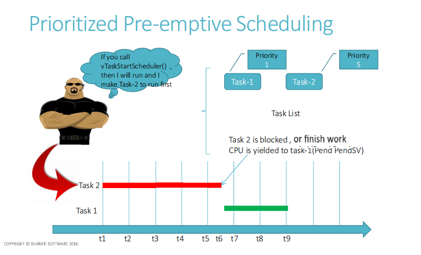
- co-operative Scheduling : là trình lập lịch dựa trên sư hợp tác. các task được chính người dùng lập thức tự chạy
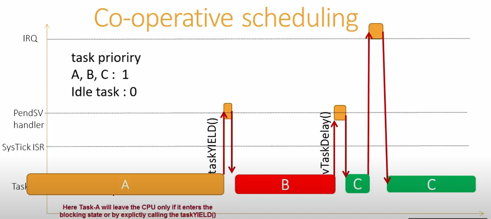
#### 2. API xTaskStartScheduler
``` C
void xTaskStartScheduler(void);
```
- Điều này được triển khai trong tasks.c của hạt nhân(Kernel) FreeRTOS và được sử dụng để khởi động trình lập lịch RTOS.
- Hãy nhớ rằng sau khi gọi hàm này, chỉ có mã trình lập lịch được khởi tạo và tất cả các Arch. Các ngắt cụ thể sẽ được kích hoạt.
- Hàm này cũng tạo tác vụ daemon nhàn rỗi và Timer
- xTaskStartScheduler() gọi đến xPortStartScheduler() để thực hiện Arch. Các khởi tạo cụ thể như : \
\- Cấu hình bộ đếm thời gian SysTick để phát hành các ngắt ở tốc độ mong muốn (như được cấu hình trong mục cấu hình configTICK_RATE_HZ trong FreeRTOSConfig.h) \
\- Cấu hình mức độ ưu tiên cho các ngắt PendSV và Systick. \
\- Bắt đầu tác vụ đầu tiên bằng cách thực thi lệnh SVC
- Về cơ bản, hàm này kích hoạt trình lập lịch (tức là nhiều ngắt cụ thể của Arch hay còn gọi là ngắt hạt nhân) và không bao giờ trả về.

## VII. FreeRTOS Kernel interrupts và Scheduling of tasks
1. FreeRTOS Kernel interrupts 
- Khi FreeRTOS chạy trên MCU dựa trên Bộ xử lý ARM Cortex Mx, các ngắt dưới đây được sử dụng để triển khai Lên lịch tác vụ.\
\- Ngắt SVC (trình xử lý SVC sẽ được sử dụng để khởi chạy Tác vụ đầu tiên) \
\- Ngắt PendSV (trình xử lý PendSV được sử dụng để thực hiện chuyển đổi ngữ cảnh giữa các tác vụ) \
\- Ngắt SysTick (Trình xử lý SysTick triển khai Quản lý Tick RTOS)
- ``note`` \ 
\- Nếu ngắt SysTick được sử dụng cho mục đích khác trong ứng dụng thì có thể sử dụng bất kỳ thiết bị ngoại vi bộ đếm thời gian nào khác có sẵn
\- Tất cả các ngắt được định cấu hình ở mức ưu tiên ngắt thấp nhất có thể.

## VIII. RTOS Tick
### 1. RTOS Tick
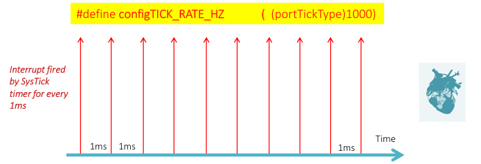
- RTOS Ticking được thực hiện bằng cách sử dụng phần cứng hẹn giờ của MCU (SysTick Timer)
- RTOS Tick dùng để theo dõi thời gian đã trôi qua
- Thay đổi RTOS Tick bằng cách cấu hình configTICK_RATE_HZ trong FreeRTOSConfig.h
- Biến toàn cục xTickCount, và nó được tăng lên một bất cứ khi nào ngắt tích tắc xảy ra

- RTOS Tick Được sử dụng để chuyển đổi ngữ cảnh sang Nhiệm vụ tiềm năng tiếp theo \
\- ISR tích tắc chạy
\- Tất cả các nhiệm vụ trạng thái sẵn sàng được quét
\- Xác định nhiệm vụ tiềm năng tiếp theo sẽ chạy
\- Nếu tìm thấy, kích hoạt chuyển đổi ngữ cảnh bằng cách đang chờ ngắt PendSV
\- Trình xử lý PendSV đảm nhiệm việc chuyển đổi ra khỏi nhiệm vụ cũ và chuyển đổi vào nhiệm vụ mới
### 2. Cấu hình RTOS tick timer (SysTick)
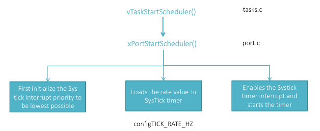
- `` Ví dụ `` \
\- Nếu configCPU_CLK_HZ = 16000000 + configTICK_RATE_HZ = 1000Hz. => portSYSTICK_NVIC_LOAD_REG = (configCPU_CLK_HZ/configTICK_RATE_HZ) -1 = 15999 \
\- khi bộ đếm(Timer) đếm đến 15999->0 ngắt được tạo ra. Thời gian sảy ra ngắt 1ms
## IX. Context Switching 
### 1. Context Switching
- Chuyển đổi ngữ cảnh là quá trình chuyển đổi ra khỏi một tác vụ và chuyển đổi vào một tác vụ khác trên CPU để thực thi.
- Trong RTOS, Chuyển đổi ngữ cảnh được xử lý bởi Trình lập lịch.
- Trong FreeRTOS, Chuyển đổi ngữ cảnh được xử lý bởi PendSV Handler tìm trong port.c
- Nếu trình lập lịch là trình lập lịch ưu tiên dựa trên mức độ ưu tiên, thì đối với mỗi lần ngắt RTOS, trình lập lịch sẽ so sánh mức độ ưu tiên của tác vụ đang chạy với mức độ ưu tiên của danh sách các tác vụ đã sẵn sàng. Nếu có bất kỳ tác vụ đã sẵn sàng nào có mức độ ưu tiên cao hơn tác vụ đang chạy thì chuyển đổi ngữ cảnh sẽ xảy ra.
- Trên FreeRTOS, bạn cũng có thể kích hoạt chuyển đổi ngữ cảnh theo cách thủ công bằng cách sử dụng macro taskYIELD()
- Chuyển đổi ngữ cảnh cũng xảy ra ngay lập tức bất cứ khi nào tác vụ mới bỏ chặn và nếu mức độ ưu tiên của nó cao hơn tác vụ đang chạy hiện tại.
### 2. Task State 
Khi một tác vụ thực thi trên Bộ xử lý, nó sử dụng
- Các thanh ghi lõi của Bộ xử lý.
- Nếu một Tác vụ muốn thực hiện bất kỳ thao tác đẩy và bật nào (trong khi gọi hàm) thì nó sử dụng bộ nhớ ngăn xếp chuyên dụng của riêng nó \
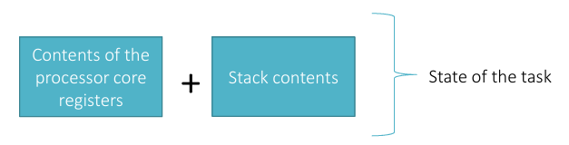
### 3. ARM Cortex Mx Core registers 
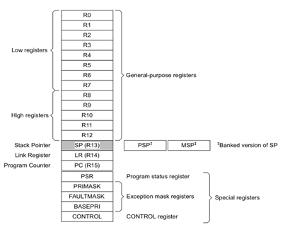
### 4. Stacks 
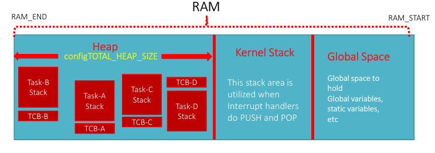
- Có chủ yếu 2 Stack Memories khác nhau trong thời gian chạy của ứng dụng dựa trên FreeRTOS
### 5. Task Creation
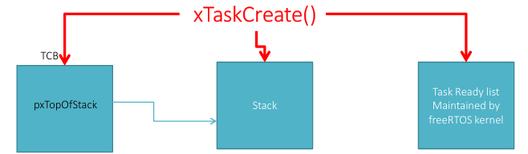
- TCB sẽ được khởi tạo trong RAM(Heap section)
- Bộ nhớ Stack chuyên dụng sẽ được khởi tạo cho một tác vụ. Bộ nhớ stack này sẽ được theo dõi bằng thanh ghi PSP.
- Task sẽ được đưa vào danh sách Sẵn sàng để người lập lịch chọn

### 6. Context Switching with animation
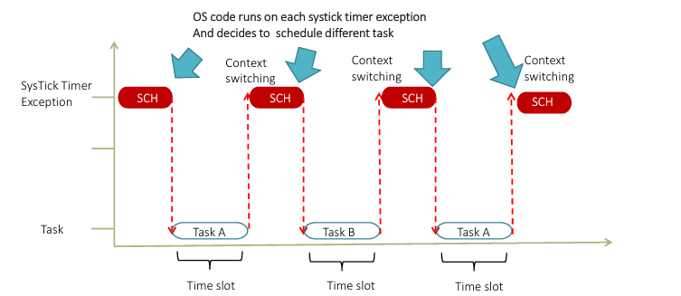
#### Task switching out procedure 
Trước khi tác vụ được chuyển đổi, cần lưu ý những điều sau.
- Các thanh ghi lõi bộ xử lý R0, R1, R2, R3, R12, LR, PC, xPSR (khung ngăn xếp) được lưu tự động vào ngăn xếp riêng của tác vụ bởi trình tự nhập ngắt SysTick của bộ xử lý.
- Nếu cần Chuyển đổi ngữ cảnh thì bộ đếm thời gian SysTick sẽ chờ Ngoại lệ PendSV và trình xử lý PendSV chạy
- Các thanh ghi lõi bộ xử lý (R4-R11, R14) phải được lưu thủ công vào bộ nhớ ngăn xếp riêng của tác vụ (Lưu ngữ cảnh)
- Lưu giá trị đầu ngăn xếp mới (PSP) vào thành viên đầu tiên của TCB
- Chọn Nhiệm vụ tiềm năng tiếp theo để thực thi trên CPU. Được chăm sóc bởi vTaskSwitchContext() được triển khai trong tasks.c
1. Exception Entry 
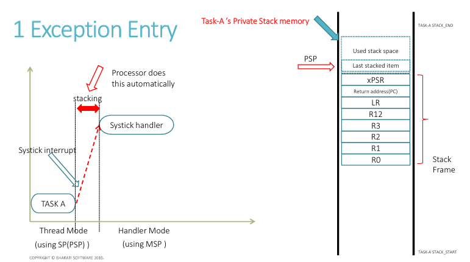
2. PendSV Handler Entry

3. Save core registers 
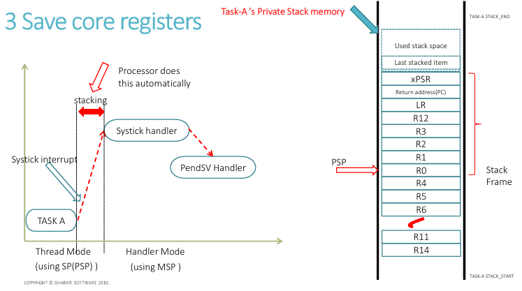
4. Save PSP Into TCB 
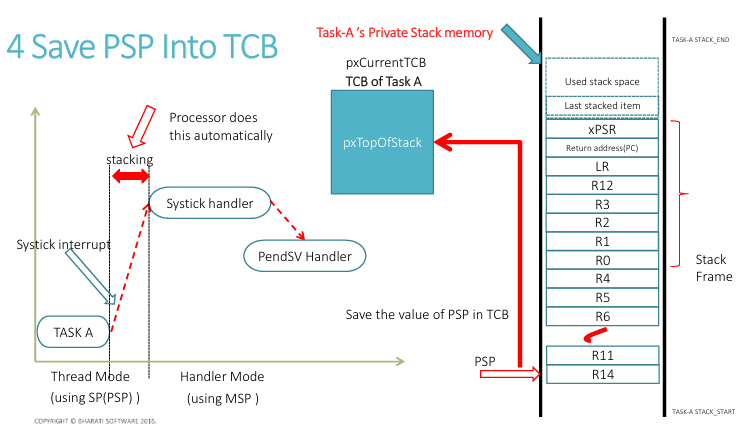

#### Task Switching In Procedure
Vì vậy, tại thời điểm này, chúng ta đã biết tác vụ nào (TCB) nên được
chuyển đổi trong. Điều đó có nghĩa là TCB của tác vụ có thể chuyển đổi mới có thể được truy cập
bởi pxCurrentTCB
- Trước tiên, hãy lấy địa chỉ của đỉnh ngăn xếp. Sao chép giá trị của
pxTopOfStack vào thanh ghi PSP
- Đưa tất cả các thanh ghi (R4-R11, R14) (Khôi phục ngữ cảnh)
- Thoát ngoại lệ: Bây giờ PSP đang trỏ đến địa chỉ bắt đầu của
khung ngăn xếp sẽ tự động được đưa ra do
thoát ngoại lệ

1. Load PSP 
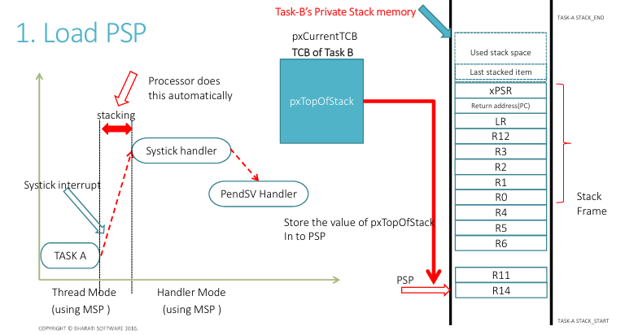
2. POP all Core Registers
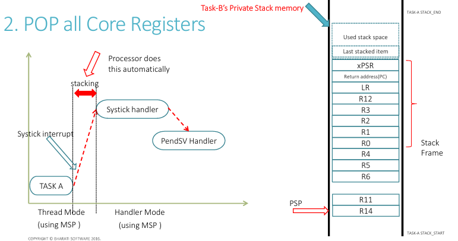
3. Exception Exit 
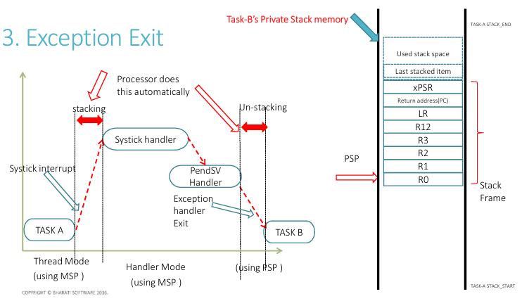

## X. RTOS Task Notification
### 1. RTOS Task Notification
- Mỗi tác vụ RTOS có 32 bit giá trị thông báo và được khởi tạo thành 0 khi tác vụ RTOS được tạo
- Thông báo tác vụ RTOS là sự kiện được gửi trực tiếp đến tác vụ có thể bỏ chặn tác vụ nhận và tùy chọn cập nhật giá trị thông báo của tác vụ nhận theo nhiều cách khác nhau. 
- ``Ví dụ``: thông báo có thể ghi đè giá trị thông báo của tác vụ nhận hoặc chỉ đặt một hoặc nhiều bit trong giá trị thông báo của tác vụ nhận.
### 2. xTaskNotifyWait API
- Nếu một tác vụ gọi xTaskNotifyWait(), thì nó sẽ đợi với thời gian chờ tùy chọn cho đến khi nhận được thông báo từ một tác vụ hoặc trình xử lý ngắt khác.
``` c
BaseType_t xTaskNotifyWait ( uint32_t ulBitsToClearOnEntry,  uint32_t  ulBitsToClearOnExit, uint32_t  *pulNotificationValue,  TickType_t  xTicksToWait ); 
/*
    @param[ulBitsToClearOnEntry] : Bất kỳ bit nào được đặt trong ulBitsToClearOnEntry sẽ bị xóa khi gọi giá trị thông báo của tác vụ RTOS gọi khi truy nhập hàm xTaskNotifyWait()
    @param[ulBitsToClearOnExit]  : Bất kỳ bit nào được đặt trong ulBitsToClearOnExit sẽ được xóa trong giá trị thông báo của tác vụ RTOS đang gọi trước khi hàm xTaskNotifyWait() thoát
    @param[pulNotificationValue] : Được sử dụng để nhận giá trị thông báo từ xTaskNotify của tác vụ RTOS muốn truyền. Nếu giá trị thông báo này không cần thiết đặt giá trị về NULL
    @param[xTicksToWait]         : Thời gian tối đa nhận thông báo
    // ms chuyển đổi tick = (ms/configTICK_RATE_HZ)/1000

    @retval : pdTRUE nếu đã nhận được thông báo. pdFALSE nếu sảy ra TIMEOUT
*/
```

### 3. API xTaskNotify() 
- xTaskNotify() được sử dụng để gửi sự kiện trực tiếp đến và bỏ chặn các tác vụ RTOS tiềm năng, và tùy chọn cập nhật giá trị thông báo của tác vụ nhận theo một trong những cách sau:
\- Viết một số 32 bit vào giá trị thông báo
\- Thêm một (tăng) giá trị thông báo
\- Đặt một hoặc nhiều bit trong giá trị thông báo
\- Giữ nguyên giá trị thông báo
``` C
BaseType_t xTaskNotify( TaskHandle_t  xTaskToNotify, uint32_t  ulValue,  eNotifyAction eAction );
/*
    @param[xTaskToNotify] : trỏ đến RTOS task vụ được thông báo
    @param[ulValue]       : Được sử dụng để cập nhật giá trị thông báo của tác vụ chủ đề
    @param[eAction]       : 
        - eNoAction 
        - eIncrement 
        - eSetValueWithOverwrite

    @retval :
*/
```

## XI. API vTaskDelete
``` C
void vTaskDelete( xTaskHandle *pxTaskToDelete );
/*
    @param[pxTaskToDelete] : 
*/
```
## FreeRTOS Hardware Interrupt Configuration Items 
### 1. configKERNEL_INTERRUPT_PRIORITY
- configKERNEL_INTERRUPT_PRIORITY: Mục cấu hình mức độ ưu tiên ngắt hạt nhân và được đặt ở mức độ ưu tiên ngắt thấp nhất có thể.
\- Systick Interrupt \
\- PendSV interrupt \
\- SVC interrupt
### 2. configMAX_SYSCALL_INTERRUPT_PRIORITY
- configMAX_SYSCALL_INTERRUPT_PRIORITY: Mục cấu hình mức độ ưu tiên ngắt hệ thống quyết định mức độ ưu tiên tối đa, và cho phép sử dụng những API freertos kết thúc bằng “FromIsr” trong các quy trình dịch vụ ngắt của chúng.
- ``note`` : 0 là mức ưu tiên tối đa của Cortex-Mx do dó không thể để những API có mức ưu tiên (Urgency) cao hơn mức ưu tiên được xác định bởi configMAX_SYSCALL_INTERRUPT_PRIORITY Do đó, bất kỳ trình dịch vụ ngắt nào sử dụng hàm API RTOS phải có giá trị ưu tiên được đặt thủ công thành giá trị bằng hoặc lớn hơn giá trị configMAX_SYSCALL_INTERRUPT_PRIORITY thiết lập

## XII. Priority of FreeRTOS Tasks 
### FreeRTOS Task Priority and Processor Interrupt/Exception Priority
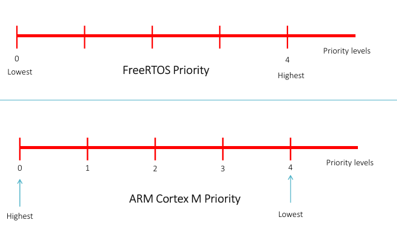
- Processor Interrupt/Exception Priority : mức ưu tiên thấp hơn sẽ được ưu tiên hơn các mưc ưu tiên cao hơn  
- FreeRTOS Task Priority : ưu tiên càng cao thì tương ứng sẽ càng được ưu tiên hơn
###  FreeRTOS Task Priority APIs
- API to set Priority 
``` c
void vTaskPrioritySet( xTaskHandle pxTask, unsigned portBASE_TYPE  uxNewPriority );
```
- API to Get Priority
``` c
unsigned portBASE_TYPE uxTaskPriorityGet( xTaskHandle  pxTask );
```
## XIII. Interrupt Safe and Interrupt Un-Safe APIs
- Bất cứ khi chương trình thực hiện ngắt phải sử dụng FreeRTOS API có kết thúc bằng từ “FromISR”(Queue_write/Queue_write_FromISR, ...)
- ``note`` : Điều này là do, Khi ở trong Contex ngắt (tức là đang ở giữa việc phục vụ ISR - handler mode), không thể quay lại Bối cảnh tác vụ (tức là tạo tác vụ để chạy bằng cách chiếm trước ISR - thread mode)

## XIV. API taskYield
- taskYIELD làm khiến task chuyển ngữ cảnh ngay lập tức(pending PendSV exception)
``` C
taskYIELD()
```
## XV. FreeRTOS Task States 
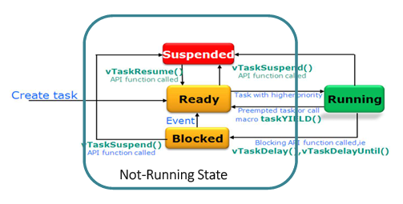
- Run state
- Blocked state
- Suspended state
- Ready state
## XVI. Task delay
- ``note`` Không bao giờ sử dụng triển khai trễ dựa trên vòng lặp for, điều này làm tiêu tốn CPU mà không thực hiện bất kỳ công việc thực sự nào vẫn sẽ ngăn chặn bất kỳ tác vụ khác

### 1. API vTaskDelay 
\- chặn task xTicksToDelay(tick) kể từ lần gọi
``` c
void vTaskDelay( const TickType_t xTicksToDelay );
```
### 2. API xTaskDelayUntil
\- xTaskDelayUntil tạo ra tần số delay chính sác
\- API unblock task sau (*pxPreviousWakeTime + xTimeIncrement)
<!-- \- API có thể trả về ngay lập tức nếu  -->
``` C
BaseType_t xTaskDelayUntil( TickType_t * const pxPreviousWakeTime, const TickType_t xTimeIncrement );
/*
    @param[pxPreviousWakeTime] : Con trỏ đến một biến lưu trữ thời gian mà tác vụ được bỏ chặn lần cuối. 
    Biến phải được khởi tạo với thời gian hiện tại trước lần sử dụng đầu tiên.
    Sau đó, biến được tự động cập nhật trong xTaskDelayUntil().
    @param[xTimeIncrement] : Chu kỳ thời gian. Task sẽ được bỏ chặn tại thời điểm (*pxPreviousWakeTime + xTimeIncrement)
*/
```
- `` note ``: chuyển đổi ms->tick: tick = ms/portTICK_PERIOD_MS


## XVII. FreeRTOS HOOK funtion
### 1. Idle task HOOK function 
- Nhiệm vụ nhàn rỗi chạy ở mức ưu tiên thấp nhất, do đó hàm idle hook như vậy sẽ chỉ được thực thi khi không có nhiệm vụ nào có mức ưu tiên cao hơn có thể chạy. Điều này khiến hàm vApplicationIdleHook() trở thành nơi lý tưởng để đưa bộ xử lý vào trạng thái năng lượng thấp - cung cấp khả năng tiết kiệm năng lượng tự động bất cứ khi nào không có quá trình xử lý nào được thực hiện.
- đặt configUSE_IDLE_HOOK thành 1 trong FreeRTOSConfig.h có thể triển khai vApplicationIdleHook
``` C
void vApplicationIdleHook( void );
```
### 2. RTOS tick HOOK function 
- Hook tick cung cấp một vị trí thuận tiện để triển khai chức năng hẹn giờ.

- đăt configUSE_TICK_HOOK được đặt thành 1 trong FreeRTOSConfig.h có thể triển khai:
``` C
void vApplicationTickHook( void );
```
### 3. Malloc failed HOOK function
- Các lược đồ phân bổ bộ nhớ được triển khai bởi heap_1.c, heap_2.c, heap_3.c, heap_4.c và heap_5.c có thể tùy chọn bao gồm hàm malloc() failure hook (hoặc callback) có thể được cấu hình để được gọi nếu pvPortMalloc() trả về NULL.

- Việc định nghĩa malloc() failure hook sẽ giúp xác định các vấn đề do thiếu bộ nhớ heap - đặc biệt là khi lệnh gọi đến pvPortMalloc() không thành công trong một hàm API.

- malloc failed hook sẽ chỉ được gọi nếu configUSE_MALLOC_FAILED_HOOK được đặt thành 1 trong FreeRTOSConfig.h.
``` C
void vApplicationMallocFailedHook( void );
```
### 4. Stack over flow HOOK function 
- configUSE_DAEMON_TASK_STARTUP_HOOK được đặt thành 1.
``` C
void vApplicationDaemonTaskStartupHook( void );
```

## Event Group API
- để có thể sử dụng API này phải cấu hình configSUPPORT_DYNAMIC_ALLOCATION = 1. Include header file
- configUSE_16_BIT_TICKS là một macro trong file cấu hình FreeRTOSConfig.h của FreeRTOS, được sử dụng để định cấu hình độ dài của kiểu dữ liệu được sử dụng để lưu trữ số lượng tick(flag) của hệ thống.
\- Nếu configUSE_16_BIT_TICKS được định nghĩa là 1, TickType_t sẽ là kiểu dữ liệu 16-bit (ví dụ: uint16_t).
\- Nếu configUSE_16_BIT_TICKS được định nghĩa là 0 (hoặc không được định nghĩa), TickType_t sẽ là kiểu dữ liệu 32-bit (ví dụ: uint32_t). 
``` C
/*
    @reval : Nếu nhóm sự kiện đã được tạo thì một xử lý đến nhóm sự kiện sẽ được trả về.
             Nếu không có đủ heap FreeRTOS để tạo nhóm sự kiện thì NULL sẽ được trả về. 
*/
EventGroupHandle_t xEventGroupCreate( void );
```
``` C
EventGroupHandle_t xEventGroupCreateStatic( StaticEventGroup_t *pxEventGroupBuffer );
```
``` C
/*
    @brief:
    
    @param[xEventGroup]
    @param[uxBitsToWaitFor]
    @param[xClearOnExit]
    @param[xWaitForAllBits]
    @param[xTicksToWait]
    
    @retval
*/
EventBits_t xEventGroupWaitBits(
                      const EventGroupHandle_t xEventGroup,
                      const EventBits_t uxBitsToWaitFor,
                      const BaseType_t xClearOnExit,
                      const BaseType_t xWaitForAllBits,
                      TickType_t xTicksToWait );
```
``` C
EventBits_t xEventGroupSetBits( EventGroupHandle_t xEventGroup, const EventBits_t uxBitsToSet );
```
``` C
BaseType_t xEventGroupSetBitsFromISR(
                         EventGroupHandle_t xEventGroup,
                         const EventBits_t uxBitsToSet,
                         BaseType_t *pxHigherPriorityTaskWoken );
```

## Mutual exculsion
- nó cho phép chỉ một luồng duy nhất có thể truy cập vào tài nguyên được chia sẻ(shared resource) tại một thời điểm. Điều này tránh được tình trạng xung đột giữa các luồng khi sử dụng tài nguyên chung. Thông thường, phải khóa tài nguyên đó trước khi sử dụng và
mở khóa sau khi bạn hoàn tất việc truy cập tài nguyên.
``` C
pthread_mutex_t mutex = PTHREAD_MUTEX_INITIALIZER; // Cấp phát tĩnh
int pthread_mutex_init(pthread_mutex_t *mutex, const pthread_mutexattr_t *atrr); // cấp phát động note khi không dùng dến phải có quá trình huỷ bỏ (pthread_mutex_destroy)

int pthread_mutex_lock(pthread_mutex_t *mutex);

int pthread_mutex_unlock(pthread_mutex_t *mutex);
```
``` C
// ex
void task1(void)
{
    pthread_mutex_lock(&mutex);
    // shared resource here
    pthread_mutex_unlock(&mutex);
}

```
## Queue
### Tổng quan

### API
- Tạo hàng chờ
``` C
QueueHandle_t xQueueGenericCreate( const UBaseType_t uxQueueLength,
                                       const UBaseType_t uxItemSize,
                                       const uint8_t ucQueueType );
```

``` C
BaseType_t xQueueGenericSend( QueueHandle_t xQueue,
                              const void * const pvItemToQueue,
                              TickType_t xTicksToWait,
                              const BaseType_t xCopyPosition );
```

``` C
BaseType_t xQueueReceive( QueueHandle_t xQueue,
                          void * const pvBuffer,
                          TickType_t xTicksToWait );
```
## Software Timer
### giới thiệu về Software Timer

### API
``` C
/*
    @brief: khi RTOS_Tick đếm đến xTimerPeriod thì thực thi pxCallbackFunction

*/
TimerHandle_t xTimerCreate( const char * const pcTimerName,
                            const TickType_t xTimerPeriod,
                            const UBaseType_t uxAutoReload,
                            void * const pvTimerID,
                            TimerCallbackFunction_t pxCallbackFunction );

void pxCallbackFunction( TimerHandle_t xTimer )
{
    // code
}

```
``` C
BaseType_t xTimerStart( TimerHandle_t xTimer, TickType_t xBlockTime );
```
``` C
BaseType_t xTimerStop( TimerHandle_t xTimer, TickType_t xBlockTime );
```
``` C
void *pvTimerGetTimerID( TimerHandle_t xTimer );
```
## Semaphore
### giới thiệu về Semaphore
- Semaphore là một cơ chế đồng bộ hóa được sử dụng trong FreeRTOS để điều phối việc truy cập vào tài nguyên dùng chung giữa các task. Semaphore hoạt động như một biến đếm, có thể được tăng hoặc giảm giá trị.

- có 2 loại semaphore : binary semaphore và counting semaphore
\- Semaphore nhị phân (binary semaphore) : cơ chế giống với mutex Có giá trị là 0 hoặc 1. Thường được dùng để bảo vệ tài nguyên chia sẻ hoặc đồng bộ hóa hai task. \
\- Semaphore tăng (counting semaphore) : Có giá trị lớn hơn 1. Thường được dùng để quản lý một số lượng tài nguyên có hạn hoặc đếm các sự kiện.

### API
- tạo Semaphore
``` C
// binary semaphore
SemaphoreHandle_t xSemaphoreCreateBinary( void );
// counting semaphore
SemaphoreHandle_t xSemaphoreCreateCounting( void ):
// Mutex
SemaphoreHandle_t xSemaphoreCreateMutex( void )

```
``` C
/*
    @brief: Trả lại một semaphore.
*/
BaseType_t xSemaphoreGive(xSemaphoreHandle xSemaphore);
```
``` C
/*
    @brief: Yêu cầu một semaphore. Nếu semaphore không có sẵn, task sẽ bị block cho đến khi semaphore có sẵn
    @param[xBlockTime] : thời gian tối đa treo task
*/
BaseType_t xSemaphoreTake(  xSemaphoreHandle xSemaphore, 
                            TickType_t xBlockTime   );
```
``` C
void vSemaphoreDelete( SemaphoreHandle_t xSemaphore );
```

chế độ tăng mưc ưu tiên 
